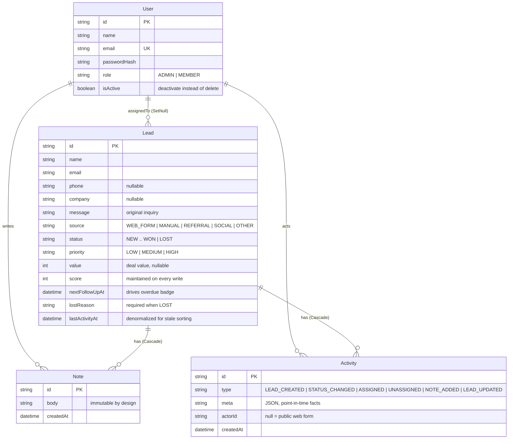
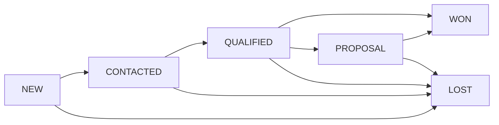

# ⚡ Leadline — a lead platform, not a lead form

Task A of the Digital Heroes Full Stack Development brief: a lead management application a small
sales team could actually use.

**Live app: https://leadline-feen.onrender.com** · **Repo root:** [../README.md](../README.md)

> Free-tier hosting sleeps after ~15 minutes idle — the first request may take 30–50 seconds to
> wake the instance. Everything after that is normal speed.

| Demo account | Email | Password | What to try |
|---|---|---|---|
| Admin | `admin@leadline.demo` | `Admin@1234` | Assign leads, delete, manage the team, reopen closed leads |
| Member | `member@leadline.demo` | `Member@1234` | Work assigned leads, get blocked from admin actions |
| Member 2 | `mia@leadline.demo` | `Member@1234` | See per-member assignment boundaries |
| Deactivated | `former@leadline.demo` | `Member@1234` | Login is rejected with 401 |

---

## What makes this more than CRUD

1. **Kanban pipeline with real rules** — the dashboard is a drag-and-drop board (native HTML5, no
   library). Dragging a card issues the same `PATCH /api/leads/:id` any API client would use. An
   illegal move is rejected by the server with `422` and the card snaps back, showing the allowed
   next stages. The client hints; the server decides.
2. **Embeddable capture widget** — `GET /embed.js` returns a loader that injects the capture form
   as an iframe. One script tag puts this pipeline behind any website. The public form is a
   product feature, not a checkbox.
3. **Lead scoring** — every write recomputes a 0–100 score from deal value, priority, source
   weight, and recency. The board sorts hottest-first; a 🔥 chip marks leads worth calling today.
4. **Append-only audit trail** — every mutation writes its activity row inside the same database
   transaction. The trail cannot drift from reality. Names are denormalized into activity meta so
   history stays truthful even if a user is later renamed or deactivated.
5. **Pipeline stages as enforced transitions** — forward moves and one step back are legal;
   `WON`/`LOST` are terminal for members (admins can reopen); `LOST` requires a reason. Funnel
   metrics stay honest because nobody can teleport a lead from NEW to WON.
6. **Live dashboard** — light polling toasts "new lead just arrived" and refreshes the board when
   a public submission lands.
7. **CSV export** — `GET /api/leads/export` honors the exact same filters as the list endpoint.
8. **Notion-inspired interface** — a sales pipeline *is* a database with views, so the app borrows
   that vocabulary: sidebar workspace shell, page emoji and title, Board/Table view tabs, filter
   chips, soft pastel tag pills for status and priority, and the lead page laid out as a document
   with a property grid, note blocks, and a quiet activity timeline. Hairline borders, ink-on-paper
   colours, one accent. Every status colour is defined once and reused across board, table, and
   badges so the whole product reads as one system.

## Stack

Next.js 15 (App Router, TypeScript) · Prisma 6 on SQLite/libSQL (local file in dev/test, Turso in
production) · zod validation · bcryptjs + jose (JWT session cookie) · Tailwind 4 · Vitest ·
GitHub Actions · Render.

## Run it locally

```bash
cd taska
npm install
copy .env.example .env        # then set AUTH_SECRET to any long random string
npx prisma db push
npm run db:seed
npm run dev                   # http://localhost:3000
```

`npm test` needs nothing external — the suite creates a throwaway SQLite file under `tests/.tmp/`.

## Architecture

```
Browser ──> Next.js middleware (edge)   redirects unauthenticated page visits, gates /team by role
        ──> Server components           read data through the same service layer as the API
        ──> /api/* route handlers       thin: parse -> service -> respond
                     │
                     ▼
        src/lib  (the entire backend, four files)
        ├── api.ts    zod schemas, typed ApiError -> status-code mapping, query parsing
        ├── auth.ts   bcrypt hashing, JWT cookie sessions, actor loading, user management
        ├── leads.ts  every domain rule: permissions, transitions, scoring, audit writes
        └── db.ts     Prisma client (plain SQLite locally, libSQL adapter when TURSO_* is set)
                     │
                     ▼
              SQLite / Turso
```

**Routes authenticate, services authorize.** Route handlers only establish *who* is calling
(`requireActor`). Every domain function in `leads.ts`/`auth.ts` takes that actor and enforces
*what they may do*, throwing typed errors (`401/403/404/409/422`) that one wrapper maps to HTTP.
Pages and API routes share this single permission surface, so the UI can never be more permissive
than the API.

**Sessions.** Login verifies bcrypt + `isActive`, then sets an HttpOnly, SameSite=Lax, 7-day JWT
cookie. Middleware verifies the signature at the edge for page redirects (no DB on the edge); API
routes re-resolve the user from the database on every request, so deactivating a user kills their
access immediately even with a valid token. Logout clears the cookie (stateless tradeoff:
documented, tested for cookie clearing).

**Client-side enforcement** (required by the brief, in addition to the server): middleware
redirects, admin-only controls (assign, delete, team page) are not rendered for members, terminal
cards are not draggable for members, and read-only leads show a "viewing only" banner.

### Data model



SQLite does not support Prisma enums, so enum-like fields are strings constrained by zod at the
boundary and by the service layer — a documented tradeoff of choosing a dialect that lets the
whole test suite run offline.

### Status pipeline



One step back is always allowed between active stages. `WON`/`LOST` are terminal for members;
admins may reopen (`WON → PROPOSAL|QUALIFIED`, `LOST → any active stage`). Moving to `LOST`
requires `lostReason`; reopening clears it. Violations return `422` with
`details.allowedNextStatuses`.

### Permission matrix

| Action | Admin | Member |
|---|---|---|
| View all leads, notes, activities | ✅ | ✅ |
| Create leads | ✅ (assign anyone) | ✅ (unassigned or self) |
| Update fields / move status / add notes | ✅ any lead | ✅ only leads assigned to them |
| Assign / unassign | ✅ | ❌ 403 |
| Delete leads | ✅ | ❌ 403 |
| Reopen WON / LOST | ✅ | ❌ 422 |
| List / create / deactivate users | ✅ | ❌ 403 |
| Deactivate own account | ❌ 422 | — |

### Lead score

`score = value points (≤40, value/2500) + priority (0/10/20) + source weight (referral 20,
web form 12, social/manual 8, other 4) + recency (≤2d 20, ≤7d 12, ≤30d 6)` — capped ≈ 100.
Recomputed on create and on every update that touches value or priority.

---

## API reference

Base URL: `https://<deployment>/api` · All bodies are JSON. Authentication is the
`leadline_session` HttpOnly cookie set by login; browser calls send it automatically, curl uses a
cookie jar as below.

### Status codes

| Code | Meaning here |
|---|---|
| 200 / 201 / 204 | OK / created / deleted (no body) |
| 400 | Malformed JSON body or invalid query parameters (`details` per field) |
| 401 | No, invalid, or expired session; wrong login credentials; deactivated user |
| 403 | Authenticated but not allowed (role or ownership) |
| 404 | Lead or user does not exist |
| 409 | Duplicate user email |
| 422 | Body failed validation or a domain rule (`details` explains, e.g. `allowedNextStatuses`) |

### Auth

```bash
curl -c jar.txt -X POST https://<host>/api/auth/login \
  -H "content-type: application/json" \
  -d '{"email":"admin@leadline.demo","password":"Admin@1234"}'
```

| Method | Path | Auth | Returns |
|---|---|---|---|
| POST | `/api/auth/login` | — | `200 {user}` + Set-Cookie · `401` bad credentials or deactivated |
| POST | `/api/auth/logout` | — | `200 {ok}` + expired cookie |
| GET | `/api/auth/me` | cookie | `200 {user}` · `401` |

### Public capture

| Method | Path | Auth | Returns |
|---|---|---|---|
| POST | `/api/public/leads` | none | `201 {ok, id}` · `422` field errors · `400` bad JSON |

Body: `name` (2–120, required), `email` (required), `phone?`, `company?`, `message?`, and
`website` — a **honeypot**: humans never see it; if a bot fills it the API answers `201` but
stores nothing.

```bash
curl -X POST https://<host>/api/public/leads \
  -H "content-type: application/json" \
  -d '{"name":"Priya Nair","email":"priya@zenkart.in","company":"Zenkart","message":"Need a storefront rebuild"}'
```

### Leads

| Method | Path | Auth | Notes |
|---|---|---|---|
| GET | `/api/leads` | any role | paginated list, filters below |
| POST | `/api/leads` | any role | manual create; members may only self-assign (`403` otherwise) |
| GET | `/api/leads/:id` | any role | includes assignee and notes · `404` |
| PATCH | `/api/leads/:id` | assigned member or admin | fields and/or `status` (+`lostReason`); `403` not yours, `422` illegal transition |
| DELETE | `/api/leads/:id` | admin | `204` · member `403` |
| PATCH | `/api/leads/:id/assign` | admin | `{assignedToId: "<userId>" \| null}`; `422` inactive target |
| GET | `/api/leads/:id/notes` | any role | newest first |
| POST | `/api/leads/:id/notes` | assigned member or admin | `201`, immutable once written |
| GET | `/api/leads/:id/activities` | any role | chronological audit trail, meta parsed |
| GET | `/api/leads/export` | any role | CSV download honoring the same filters as the list |

**List parameters** — `GET /api/leads?page=1&pageSize=20&status=QUALIFIED&priority=HIGH&assignedTo=<userId|unassigned>&q=zenkart&sort=score&order=desc`

| Param | Values | Default |
|---|---|---|
| `page` | ≥ 1 | 1 |
| `pageSize` | 1–100 (`400` beyond) | 20 |
| `status` | `NEW CONTACTED QUALIFIED PROPOSAL WON LOST` | — |
| `priority` | `LOW MEDIUM HIGH` | — |
| `assignedTo` | user id or `unassigned` | — |
| `q` | substring of name / email / company | — |
| `sort` | `createdAt lastActivityAt value score` | `createdAt` |
| `order` | `asc desc` | `desc` |

Response envelope:

```json
{
  "data": [ { "id": "…", "name": "…", "status": "QUALIFIED", "score": 84, "assignedTo": { "id": "…", "name": "Mia D'Souza" }, "…": "…" } ],
  "meta": { "page": 1, "pageSize": 20, "total": 16, "totalPages": 1 }
}
```

Example lifecycle session:

```bash
curl -b jar.txt -X PATCH https://<host>/api/leads/<id> \
  -H "content-type: application/json" -d '{"status":"CONTACTED"}'

curl -b jar.txt -X PATCH https://<host>/api/leads/<id> \
  -H "content-type: application/json" -d '{"status":"WON"}'
# -> 422 {"error":"Cannot move this lead from CONTACTED to WON",
#         "details":{"allowedNextStatuses":["QUALIFIED","NEW","LOST"]}}

curl -b jar.txt -X POST https://<host>/api/leads/<id>/notes \
  -H "content-type: application/json" -d '{"body":"Intro call done, sending scope."}'

curl -b jar.txt https://<host>/api/leads/<id>/activities
```

### Users (admin only — members receive 403)

| Method | Path | Notes |
|---|---|---|
| GET | `/api/users` | includes `assignedLeadCount` |
| POST | `/api/users` | `{name, email, password ≥8, role}` · `409` duplicate email |
| PATCH | `/api/users/:id` | `{isActive: boolean}` · `422` self-deactivation |

### Embed widget

```html
<script src="https://<host>/embed.js" async></script>
```

The loader injects an iframe of `/capture`. Submissions flow through the same public endpoint,
honeypot included.

---

## Tests

`npm test` — 40 cases, three suites, zero external services (fresh SQLite file per run, route
handlers invoked directly with real `Request` objects and real login cookies):

- **auth-rules** — wrong password / deactivated user / missing / garbage cookie → 401; the full
  member-vs-admin 403 matrix (users, delete, assign, foreign leads, export); cookie flags;
  self-deactivation guard; duplicate email 409.
- **public-capture** — 201 + NEW/WEB_FORM lead + LEAD_CREATED activity + computed score; 422 field
  errors; 400 malformed JSON; honeypot drops silently.
- **lead-lifecycle** — create → assign → status → note with an ordered 4-event trail; stage-skip
  422 with `allowedNextStatuses`; LOST-requires-reason; member-terminal vs admin-reopen; combined
  filters; pagination meta math; invalid filters 400.

CI (`.github/workflows/ci.yml` at the repo root) runs install → schema push → tests → production
build on every push.

## Deployment

**Render** free web service (Node, region Singapore, root directory `taska`) + **Turso** free
SQLite database (region Mumbai, next to the app). The service is declared as code in
[`../render.yaml`](../render.yaml), so it can be recreated from the repo as a Blueprint.

Every push to `main` runs CI (install → schema → 40 tests → production build). Production releases
are triggered explicitly against the Render API — the service was created from the public repo URL
rather than through Render's GitHub App, so it receives no push webhooks. Connecting the repo in
the Render dashboard turns on push-triggered deploys without any code change.

Environment variables:

| Name | Purpose |
|---|---|
| `AUTH_SECRET` | JWT signing secret (any long random string) |
| `TURSO_DATABASE_URL` | `libsql://…` — its presence switches Prisma to the libSQL adapter |
| `TURSO_AUTH_TOKEN` | Turso database token |
| `DATABASE_URL` | local development and tests only (`file:./dev.db`) |

One-time database setup, run locally with the two `TURSO_*` variables exported:

```bash
npm run db:push:remote   # applies the Prisma schema DDL over libSQL
npm run db:seed          # loads the demo team and pipeline
```

`prisma db push` speaks the SQLite file protocol, not `libsql://`, so
[`scripts/push-schema.ts`](scripts/push-schema.ts) generates the identical DDL with
`prisma migrate diff` and executes it through the libSQL client — same schema, one extra hop.

Free-tier tradeoff, stated plainly: the instance sleeps after ~15 minutes idle and takes 30–50
seconds to wake on the next request. The app itself is stateless, so nothing is lost on sleep.

## Assumptions & scope decisions

- Two inquiries from the same email are two leads — sales teams triage duplicates by hand.
- Notes are immutable and deletes are admin-only; the audit trail is append-only by construction.
- Anti-spam is a honeypot, not rate limiting — right-sized for a demo; the seam for a limiter is
  the public route handler.
- Logout clears the cookie but the JWT stays valid until expiry (stateless sessions, 7-day cap) —
  the standard tradeoff, noted openly.
- Deactivation replaces deletion for users so history keeps its authors.
- Currency is displayed as INR — a display concern only.
- `npm audit` reports transitive dev-tooling advisories (eslint/postcss chains); nothing ships to
  the production bundle.

## Where AI was used

_Draft for Suryansh to edit into his own words before submitting:_

> I used Claude (Anthropic) as a pair programmer across this build: shaping the architecture
> (single service layer for pages and API), generating first passes of the route handlers, tests,
> and this README, and pressure-testing decisions like SQLite-vs-Postgres and stateless sessions.
> Everything was reviewed and iterated by me: I set the product direction (Notion-style UI,
> pipeline rules, scoring, the embed widget), chose what to cut, and verified every flow by hand
> against the running app. The commit history shows the step-by-step process.
